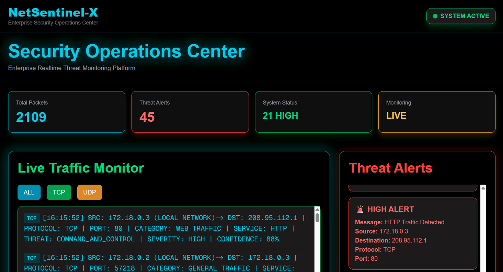
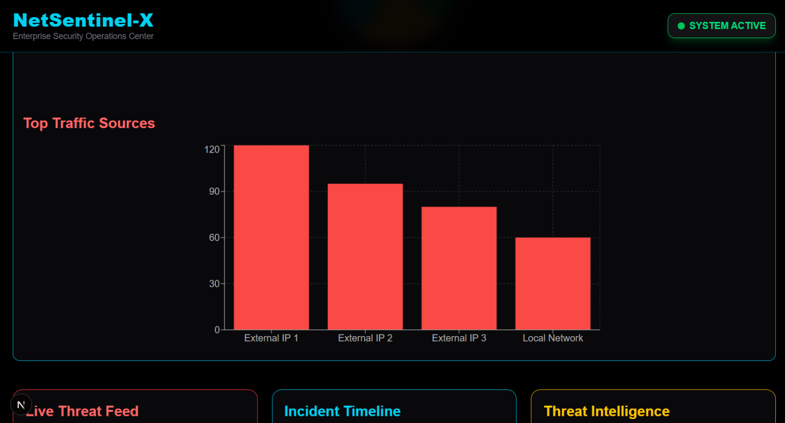
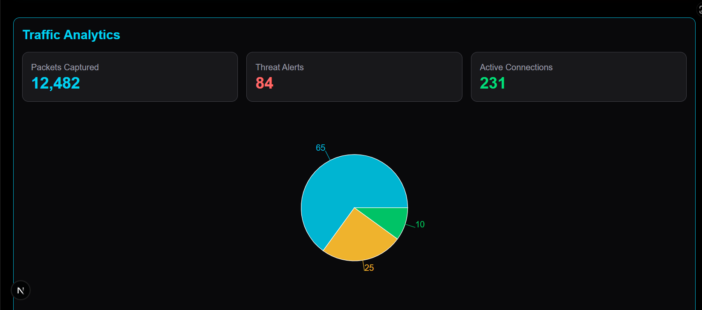
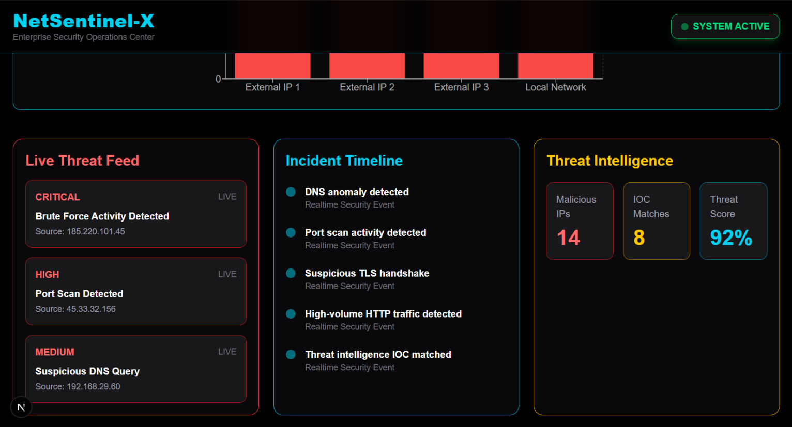

<h3 align="center">
Cybersecurity Engineer • Threat Intelligence &amp; Detection Engineering • Building Cygnal &amp; NetSentinel-X
</h3>

<p align="center">
  
</p>

---

```bash
$ ./contribution_monitor.sh
```

## 📈 LIVE CONTRIBUTION GRAPH

<p align="center">
    
</p>

---

```bash
$ system_status --about
```

## 💻 ABOUT

```diff
+ Cybersecurity Engineer focused on OSINT, Threat Intelligence, and Detection Engineering
```

```yaml
Name: Ayush Singh

Role:
  - Cybersecurity Engineer
  - OSINT Developer
  - Threat Intelligence Builder

Current Project:
  Cygnal — Advanced OSINT Investigation Platform
  NetSentinel-X — Realtime SOC & Threat Detection System

Focus Areas:
  - OSINT Investigations
  - Malware Analysis
  - Detection Engineering
  - Threat Hunting
  - Security Automation

Goal:
  Build globally recognized cybersecurity products
```

---

```bash
$ tech_stack --show
```

## ⚙️ TECH STACK

### Languages

<p align="center">
  
</p>

---

### Frontend & Backend

<p align="center">
  
</p>

---

### Databases & Cloud

<p align="center">
  
</p>

---

### Hosting / SaaS

<p align="center">
  
</p>

---

### Servers & DevOps

<p align="center">
  
</p>

---

### Development Tools

<p align="center">
  
</p>

---

### Design & Creative

<p align="center">
  
</p>

---

### AI / ML

<p align="center">
  
</p>

---

### SECURITY ECOSYSTEM

<p align="center">


</p>

---

### Cybersecurity & OSINT Tools

<p align="center">


</p>

---

### Platforms & Ecosystem

<p align="center">


</p>

---

```bash
$ system_analytics.sh --fetch-all
```

## 📊 GITHUB ANALYTICS

<p align="center">
  

  
</p>

```bash
$ language_analysis.exe
```

<p align="center">
  
</p>

---


```bash
$ activity_matrix.exe
```

## 📈 ACTIVITY GRAPH

<p align="center">
  
</p>

<p align="center">
  
  
  
</p>

---

```bash
$ featured_projects --list
```

# 💠 FEATURED PROJECT

## Cygnal — Advanced OSINT Investigation Platform

## PLATFORM PREVIEW

<p align="center">
  
  
  
</p>

<p align="center">
  
  
  
</p>

---

```yaml
Core Features:
  - Passive DNS Lookup
  - IP Reputation Analysis
  - Hybrid Malware Scanning
  - Session Collaboration
  - Investigation Dashboard
  - Audit Viewer
  - Docker Deployment
  - Threat Intelligence Workflows
  - PDF Export System
```

### Stack

```bash
Python • FastAPI • Next.js • MongoDB • Docker • Selenium
```

### Repository

```bash
https://github.com/ayushsingh257/Cygnal
```

---


# 🛡️ FEATURED PROJECT

## NetSentinel-X — Realtime SOC & Threat Detection Platform

## PLATFORM PREVIEW

<p align="center">
  
  
  


  
  
</p>

```yaml
Core Features:
  - Realtime Threat Monitoring
  - DPI-Based Packet Analysis
  - IOC Detection
  - Incident Timeline Tracking
  - Traffic Analytics Dashboard
  - Live Security Alerts
  - Threat Intelligence Visualization
```

### Stack

```bash
Python • React • Flask/FastAPI • Chart.js • WebSockets • Docker
```

### Repository

```bash
https://github.com/YOUR_USERNAME/NetSentinel-X
```

---

```bash
$ security_certifications --verify
```

# 🥇 CERTIFICATIONS

<p align="center">


</p>

```yaml
Certifications:
  - EC-Council Certified Ethical Hacker (CEH v13)
  - Google Cybersecurity Professional Certificate
  - Cisco Ethical Hacker
  - Cisco Junior Cybersecurity Analyst
  - IBM Cybersecurity Fundamentals
  - Fortinet Threat Landscape
  - NVIDIA Networking Fundamentals

Job Simulations:
  - Deloitte Cybersecurity Simulation
  - Tata Cybersecurity Analyst
  - Datacom Cybersecurity Simulation
```

---

```bash
$ research_logs.sh --read
```

# 📝 RESEARCH & WRITEUPS

<p align="center">


</p>

### 📖 Published Articles

- OSINT &amp; Investigation Research  
- Cybersecurity Learning Notes  
- Threat Intelligence Concepts  
- Vulnerability &amp; Security Writeups  

```bash
Medium:
https://medium.com/@Ayush.S.K
```

---

```bash
$ connect --init
```

# 🌐 CONNECT

<p align="center">

<a href="https://github.com/ayushsingh257">
  
</a>

<a href="https://www.linkedin.com/in/ayush-singh-kshatriya/">
  
</a>

<a href="https://medium.com/@Ayush.S.K">
  
</a>

</p>
